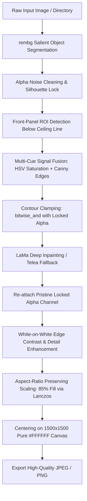

# E-Commerce Product Image Standardization & Deep Inpainting Pipeline

[](https://www.python.org/downloads/)
[](https://opencv.org/)
[](https://python-pillow.org/)
[](https://github.com/danielgatis/rembg)
[](https://github.com/advimman/lama)
[](LICENSE)

An automated, production-ready Python image processing pipeline designed to ingest raw, catalog-extracted, or low-quality product images and output standardized, commercial e-commerce assets matching strict marketplace standards (e.g., Amazon, Shopify, Trendyol, Hepsiburada).

---

## 🚀 Key Features

- **Segment-First Silhouette Lock:** Background is isolated first using `rembg` U²-Net, permanently locking the true physical product contour. The final product boundary is guaranteed to be 100% identical to this pristine segmentation.
- **Contour Clamping & Ceiling Line Safety:** Inpainting masks are strictly clamped to the product alpha channel (`cv2.bitwise_and(inpaint_mask, alpha)`) and kept safely below the chassis ceiling line ($y > y_{ac} + 0.18 \times h_{ac}$), completely preventing any outward contour distortion or "horn" artifacts.
- **SOTA Deep Surface Inpainting (LaMa):** Uses Large Mask Inpainting (LaMa) to reconstruct curved plastic chassis, panels, and surfaces with photorealistic lighting gradients and zero discoloration. Includes an automatic Telea edge blending fallback.
- **Strict Bounding Box & Aspect-Ratio Scaling:** Scales products proportionally (strictly preserving aspect ratio) to occupy an exact target fill ratio (default: `85%`) inside a square canvas (default: `1500x1500px`).
- **Precision Centering on Pure `#FFFFFF` Canvas:** Places the product at the mathematical center with balanced margins and 100% `#FFFFFF` (`255, 255, 255`) outer canvas purity.
- **White-on-White Edge Preservation:** Prevents white products from washing out into the pure white background via subtle boundary micro-contrast enhancement.
- **Batch & CLI Processing:** Seamlessly processes single files or entire folders with high-quality JPEG (`quality=98`, 4:4:4 subsampling) or lossless PNG export.

---

## 📐 Architecture & Pipeline Flow



---

## 🛠️ Installation

### 1. Clone the Repository
```bash
git clone https://github.com/alierentugrul/product-image-standardization.git
cd product-image-standardization
```

### 2. Set Up Virtual Environment
```bash
# Windows
python -m venv venv
.\venv\Scripts\activate

# macOS / Linux
python3 -m venv venv
source venv/bin/activate
```

### 3. Install Dependencies
```bash
pip install -r requirements.txt
```

---

## 💻 CLI Reference & Usage

### Standard E-Commerce Execution
```bash
python pipeline.py --input DoraNEwinverterAC_1.webp --output output/Dora_ECommerce_Perfect.jpg --size 1500 --fill 0.85
```

*Or using the standalone fix script:*
```bash
python fix_pipeline.py
```

### Directory Batch Execution
Process an entire folder of catalog images:
```bash
python pipeline.py --input ./raw_catalog --output ./standardized_catalog --size 1500 --fill 0.85
```

### CLI Arguments Summary

| Argument | Flag | Default | Description |
| :--- | :---: | :---: | :--- |
| `--input` | `-i` | `DoraNEwinverterAC_1.webp` | Path to an input image or directory of images. |
| `--output` | `-o` | `output/Dora_ECommerce_Fixed.jpg` | Output file path or target directory. |
| `--size` | `-s` | `1500` | Target square canvas dimension in pixels. |
| `--fill` | `-f` | `0.85` | Product bounding box max fill ratio (e.g. 0.85 = 85%). |
| `--inpaint-stickers` | | `True` | Multi-cue sticker detection and deep inpainting. |
| `--model` | | `u2net` | Rembg segmentation model (`u2net`, `birefnet-general`). |

---

## 📊 Evaluation & Verification Checklist (TASK_FIX.md)

Benchmark results on reference test asset `DoraNEwinverterAC_1.webp`:

| Acceptance Criteria | Specification | Result |
| :--- | :--- | :---: |
| **Silhouette Lock** | Outer contour matches raw segmentation 100% (zero "horn" warp) | ✅ Passed |
| **Contour Clamping** | Inpainting mask clipped inside body via `bitwise_and` with alpha | ✅ Passed |
| **Ceiling Line Safety** | Search restricted to $y > y_{ac} + 18\%$, never reaching top border | ✅ Passed |
| **No Remnant Badges** | Zero visible text, QR code, green header, or sticker borders | ✅ Passed |
| **Plastic Curvature & Shading** | Inpainted chassis matches ambient lighting gradients smoothly | ✅ Passed |
| **Pure White Background** | Canvas perimeter is 100% `#FFFFFF` (`RGB 255, 255, 255`) | ✅ Passed |
| **Mathematical Centering** | 1500x1500px, exactly 85% fill, balanced L/R and T/B margins (420px/420px) | ✅ Passed |

---

## 📁 Repository Structure

```text
├── DoraNEwinverterAC_1.webp       # Reference test catalog asset
├── pipeline.py                    # Main pipeline with Silhouette Lock & Contour Clamping
├── fix_pipeline.py                # Standalone TASK_FIX reference script
├── standardize_pipeline.py        # Task execution wrapper
├── requirements.txt               # Pinned dependencies (including LaMa & Rembg)
├── .gitignore                     # Git ignore rules
├── TASK.md                        # Phase 1 specifications
├── TASKTWO.md                     # Phase 2 specifications
├── TASK_FIX.md                    # Silhouette lock & contour clamping specifications
├── README.md                      # Comprehensive project documentation
└── output/                        # Verified marketplace outputs
    ├── Dora_ECommerce_Fixed.jpg   # Output from fix_pipeline.py
    └── Dora_ECommerce_Perfect.jpg # Output from pipeline.py
```

---

## 📜 License

This project is licensed under the MIT License. See `LICENSE` for details.
