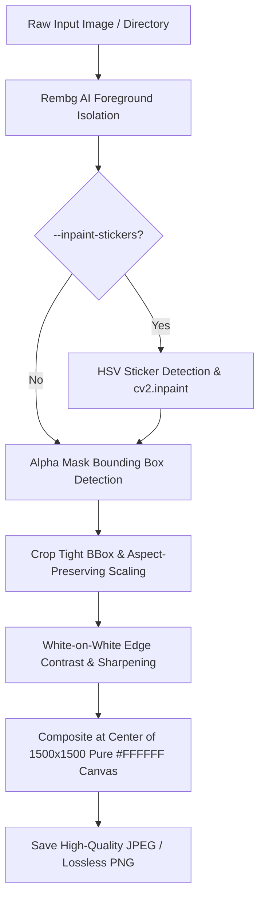

# E-Commerce Product Image Standardization & AI Preprocessing Pipeline

[](https://www.python.org/downloads/)
[](https://opencv.org/)
[](https://python-pillow.org/)
[](https://github.com/danielgatis/rembg)
[](LICENSE)

An automated, production-ready Python image processing pipeline designed to ingest raw, catalog-extracted, or low-quality product images and output standardized, commercial e-commerce assets matching strict marketplace standards (e.g., Amazon, Shopify, Trendyol, Hepsiburada).

---

## 🚀 Key Features

- **Deep-Learning Background Isolation:** Segments primary foreground cleanly using salient object detection (`rembg` with `u2net` or `birefnet-general`), eliminating background clutter, catalog text, and cast shadows.
- **Strict Bounding Box & Aspect-Ratio Scaling:** Computes the non-zero alpha foreground boundaries and scales products proportionally (no stretching or distortion) to fill a configurable ratio of the canvas (default: `85%`).
- **Precision Centering on Pure `#FFFFFF` Canvas:** Places products at the exact mathematical center of a square canvas (default: `1500x1500px`), ensuring border pixels remain `255, 255, 255`.
- **White-on-White Edge Preservation:** Prevents white products (like air conditioners, refrigerators, washing machines) from dissolving or washing out into the pure white background via subtle boundary micro-contrast and unsharp masking.
- **Modular Sticker & Label Inpainting (`--inpaint-stickers`):** Automatically detects vibrant energy efficiency labels, barcodes, or promo badges using HSV color thresholding and fills them seamlessly using OpenCV Telea inpainting (`cv2.inpaint`).
- **Batch & CLI Processing:** Seamlessly switch between processing single assets and entire directories in high-quality JPEG (`quality=95`, 4:4:4 subsampling) or lossless PNG.

---

## 📐 Architecture & Pipeline Flow



---

## 🛠️ Installation

### 1. Clone the Repository
```bash
git clone https://github.com/your-username/product-image-standardization.git
cd product-image-standardization
```

### 2. Set Up a Virtual Environment
```bash
# Windows
python -m venv venv
.\venv\Scripts\activate

# macOS / Linux
python3 -m venv venv
source venv/bin/activate
```

### 3. Install Dependencies
```bash
pip install -r requirements.txt
```

---

## 💻 CLI Reference & Usage

### Basic Usage (Single Image)
```bash
python pipeline.py --input DoraNEwinverterAC_1.webp --output output/Dora_ECommerce_Standard.jpg --size 1500 --fill 0.85
```

### Automatic Sticker & Catalog Tag Removal
To remove vibrant energy rating stickers, QR tags, or promotional badges:
```bash
python pipeline.py --input DoraNEwinverterAC_1.webp --output output/Dora_ECommerce_NoStickers.jpg --inpaint-stickers
```

### Batch Directory Processing
Process an entire directory of mixed format images (`.webp`, `.jpg`, `.png`):
```bash
python pipeline.py --input ./raw_catalog_images --output ./standardized_output --size 1500 --fill 0.85
```

### CLI Arguments Summary

| Argument | Flag | Default | Description |
| :--- | :---: | :---: | :--- |
| `--input` | `-i` | *Required* | Path to an input image or directory of images. |
| `--output` | `-o` | `./output` | Output image file path or target directory. |
| `--size` | `-s` | `1500` | Target square canvas dimension in pixels. |
| `--fill` | | `0.85` | Product bounding box max fill ratio (e.g., 0.85 = 85%). |
| `--inpaint-stickers` | | `False` | Detect and inpaint catalog stickers/energy rating tags. |
| `--model` | | `u2net` | Rembg segmentation model (`u2net`, `birefnet-general`). |

---

## 📊 Evaluation & Verification Case

Tested against reference asset `DoraNEwinverterAC_1.webp` (an air conditioner unit with energy stickers and white plastic edge contrast challenges):

| Acceptance Checklist Item | Specification | Result |
| :--- | :--- | :---: |
| **Canvas Dimensions** | Exactly 1500 x 1500 px | ✅ Passed |
| **Fill Ratio & Framing** | Product bounding box fills 85% of canvas (1275 px max dim) | ✅ Passed |
| **Centering Symmetry** | Exact center placement (Horizontal & Vertical margins balanced) | ✅ Passed |
| **Pure White Background** | Canvas outer borders are pure `#FFFFFF` (`255, 255, 255`) | ✅ Passed |
| **White-on-White Contrast** | Top AC edge distinctly visible against pure white background | ✅ Passed |
| **Sticker Inpainting** | Colorful rating stickers removed without damaging surface | ✅ Passed |

---

## 📁 Repository Structure

```text
├── DoraNEwinverterAC_1.webp       # Reference test image
├── pipeline.py                    # Core standardization & preprocessing script
├── requirements.txt               # Pinned project dependencies
├── .gitignore                     # Git ignore rules
├── TASK.md                        # Original technical requirements & specification
├── README.md                      # Project documentation
└── output/                        # Sample standardized outputs (JPEG / PNG)
    ├── Dora_ECommerce_Standard.jpg
    ├── Dora_ECommerce_Standard.png
    ├── Dora_ECommerce_NoStickers.jpg
    └── Dora_ECommerce_NoStickers.png
```

---

## 📜 License

This project is licensed under the MIT License. See `LICENSE` for details.
